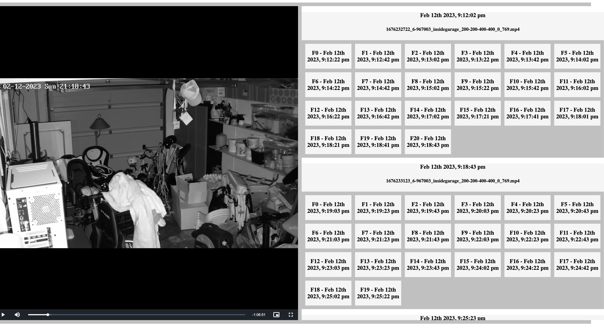

# Kerberos Vault

This repository showcases how to build an HLS stream of fragmented MP4s stored in Kerberos Vault. An event list is shown which allows you to browse through the HLS steam.

When clicking on the fragments (boxes) and timings, the `videojs` player will navigate through the HLS stream showing the relevant part of the entire recording.

## Some background

[Kerberos Agents](https://github.com/kerberos-io/agent) are connected to IP cameras and are recording (fragmented) MP4s based on specific conditions/configurations. Those recordings are stored in [Kerberos Vault](https://github.com/kerberos-io/vault) on a specific storage provider (AWS, Minio, Google storage, etc).

Once the recording is stored, several information is calculated, such as the fragment durations (if recording is fragmented). This information can be used to build up a HLS stream `.m3u8` file.

## HLS - m3u8 file

There are several ways to stream recordings into a browser, such as HLS, Dash and others. Within the Kerberos.io suite we are working with HLS as our standard, as it supports the streaming of fragmented MP4s.

A typical `.m3u8` file will look like this.

    #EXTM3U
    #EXT-X-VERSION:7
    #EXT-X-TARGETDURATION:30
    #EXT-X-MEDIA-SEQUENCE:1
    #EXT-X-PLAYLIST-TYPE:VOD
    #EXT-X-INDEPENDENT-SEGMENTS
    #EXT-X-MAP:URI="https://gateway.eu1.xxx8f596",BYTERANGE="680@0"
    #EXTINF:19.967000,
    #EXT-X-BYTERANGE:5014474@680
    https://gateway.eu1.xxx8f596
    #EXTINF:19.967000,
    #EXT-X-BYTERANGE:5012356@5015154
    https://gateway.eu1.xxx8f596
    #EXTINF:19.966000,
    #EXT-X-BYTERANGE:5080900@10027510
    https://gateway.eu1.xxx8f596
    #EXTINF:1.996000,
    #EXT-X-BYTERANGE:504350@100477198
    https://gateway.eu1.xxx8f596
    ....
    #EXT-X-DISCONTINUITY
    #EXT-X-MAP:URI="https://gateway.eu1.xxx8f596",BYTERANGE="680@0"
    #EXTINF:19.967000,
    #EXT-X-BYTERANGE:5069836@680
    https://gateway.eu1.xxx8f596
    #EXTINF:19.967000,
    #EXT-X-BYTERANGE:5009316@5070516
    ....
    #EXT-X-ENDLIST

The key elements in previous mentioned `.m3u8` file are `#EXT-X-INDEPENDENT-SEGMENTS` and `#EXT-X-DISCONTINUITY`. These attributes allows us to chain multiple fragmented MP4s and create a single player for multiple recordings. This is useful for a full-day or just showing all the relevant recordings without the need of scrolling through multiple recordings.

## Drifting

The disadvantage of chaining fragmented MP4s into a single HLS stream, is that it may introduce the concept of drifting. It may appear that frames are missing as the full length of the HLS stream is not matching the `start time + end time`.
